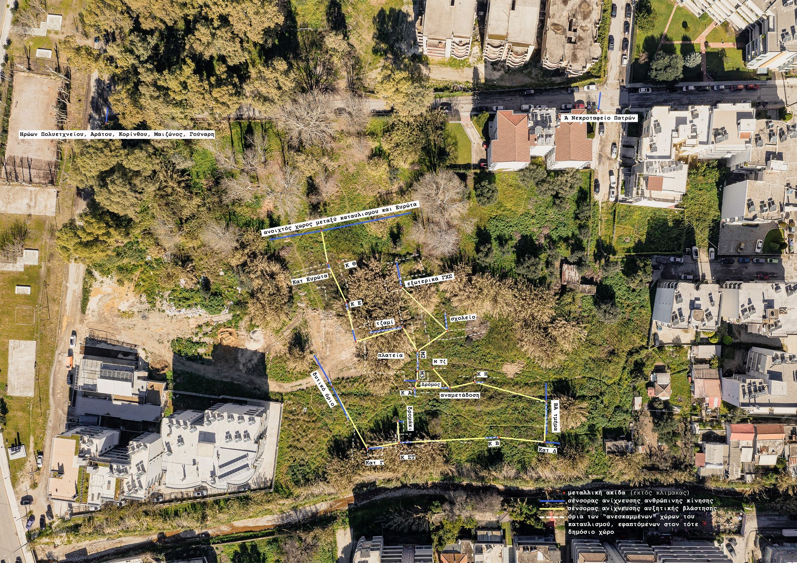

<html>
<head>

</head>
<body>

 Lorem ipsum dolor sit amet, consectetur adipiscing elit. Aliquam posuere turpis vel enim eleifend, in dignissim mauris tempor. Suspendisse non porttitor lorem. Cras id est ultrices, faucibus nisl non, eleifend diam. Aenean vestibulum risus ut risus ullamcorper, sed congue leo accumsan. Sed eu lacus ut erat blandit efficitur. In hac habitasse platea dictumst. Integer mattis tempus magna nec fermentum. Nunc eget magna ut mauris vulputate bibendum. Ut dignissim ligula ac leo bibendum, eget eleifend nisi pulvinar. Ut consectetur iaculis ultrices. Maecenas odio lectus, iaculis semper convallis in, finibus vel nisi. Nulla accumsan ut lorem sit amet facilisis. Aenean congue elementum tristique. Praesent congue consectetur sapien ut interdum.

Nunc aliquam blandit sapien. Aliquam sit amet nibh ut nibh efficitur aliquet. Suspendisse tempor eros sit amet metus dictum volutpat. Curabitur ac porta lorem, nec semper arcu. Nam et sollicitudin mauris. Phasellus ornare, quam sed egestas maximus, dui ligula congue nisl, in dapibus urna magna eu felis. Praesent aliquet leo lectus, a porta dolor fermentum sit amet. Vivamus sed dolor interdum massa ultricies auctor. Quisque iaculis blandit tellus, in iaculis urna blandit a. 

<audio src="file_example_MP3_700KB.mp3" id="sample-audio"></audio>

 <button type="button" onclick="document.getElementById('sample-audio').play()">Click Me!</button> 

<iframe src="https://board.net/p/echoing_evrotas_object_lists"></iframe>

</body>
</html>
